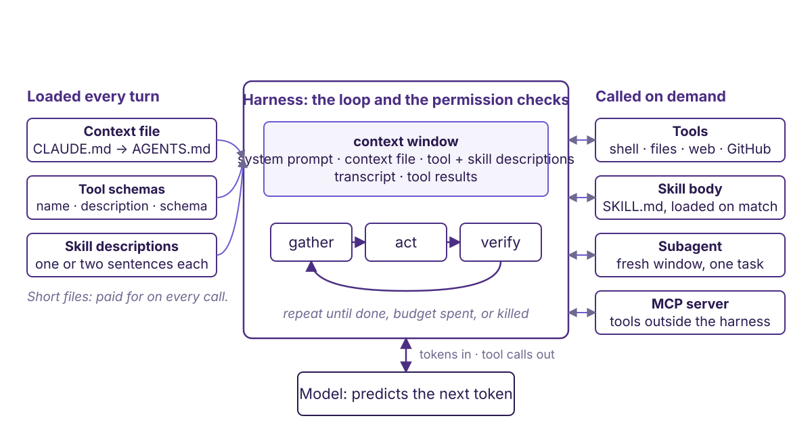
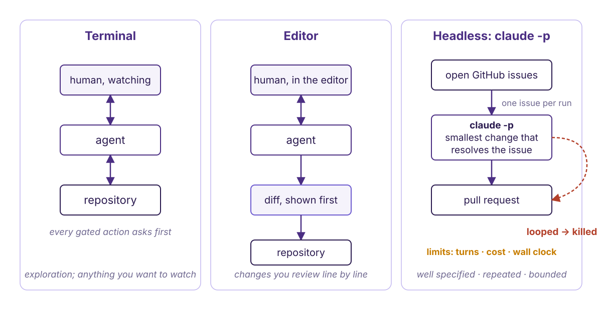
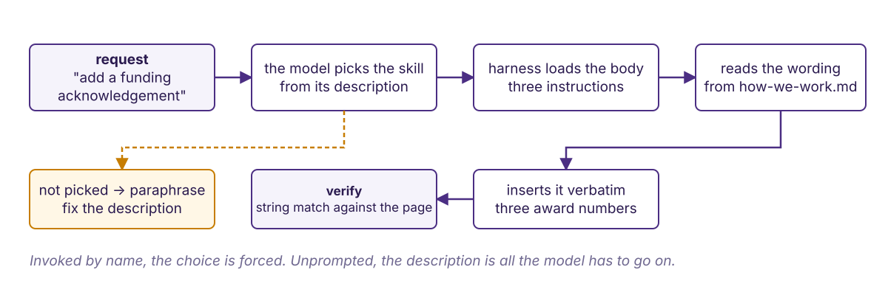

<!-- Spoken notes live in book/teaching/agents-intro/lecture.md; this deck keeps
     words to a minimum and lets the diagrams (book/img/agents-*.svg, generated by
     figscripts/make_diagrams.py) carry the flow. Amber blocks are unverified facts. -->

## {background-color="#f5f3fb"}

[🤖]{.lecture-icon}

### Today's question

**A model that reads your files, runs your code, opens a pull request.**

What is it made of, and how do we run it without losing the audit trail?

::: {.notes}
One object for the whole session: an agent run. By the end the room can draw one, name its parts, point at where GAIA already uses one, and say what a run must leave behind to be trusted. Five segments, minute tags on each opener.
:::

## Sources



::: {.notes}
Two blog posts from our own practice and the eScience half-day this mirrors. The event page names no instructors and links no materials; say so.
:::

## Model, prompt, agent {background-color="#f5f3fb"}

[0 to 1 min]{.minutes}

| | |
|---|---|
| **Open-weight model** | weights on your hardware; you pay in compute |
| **Private model** | API only; pay per token; can change under you |
| **Prompt** | text placed in the window. Nothing else happens. |
| **Agent** | the same model, in a loop, with tools |

::: {.notes}
Three definitions and one distinction. HazEvalHub's prototype ran a 7B Qwen and an 8B Llama locally next to cloud models. A prompt reads no file and runs no code; a chat interface hides this by re-sending the transcript. The agent is the model plus something that runs its commands. This takes two to three minutes, not one; borrow from segment 6 to 14.
:::

## Chat, script, agent

[1 to 6 min]{.minutes}

{.r-stretch}

::: {.takeaway}
Chat: you close every loop. Script: every branch pre-written. Agent: the model picks the next step from what it just saw.
:::

::: {.notes}
Walk left to right. A: quality bounded by your patience for closing loops. B: deterministic; an unexpected input is a crash and a person reads the log. C: gather, act, verify, repeat. An unexpected state becomes a decision, which can be wrong or endless; a crash at least stops. The four verbs are our labels for what the tool calls turn out to be; the model has no stages, only one token stream. Next slide shows the whole thing as code.
:::

## The whole thing, mechanically

```python
messages = [system_prompt, context_file, tool_schemas, task]
while True:
    out = model(messages)                      # one API call: tokens in, tokens out
    if out.stop_reason != "tool_use":
        break                                  # plain text: the model says it is done
    if not permitted(out.tool, out.args):      # the harness pauses here, not the model
        result = "denied by user"
    else:
        result = run(out.tool, out.args)       # shell, file, web, GitHub ...
    messages += [out, tool_result(result)]     # the result re-enters the window
```

::: {.dim}
A tool call is structured tokens the harness parses: `{"name": "bash", "input": {"command": "pixi run spellcheck"}}`. The harness is this loop plus the permission check. The loop is generic; `CLAUDE.md`, skills and `claude -p` are one vendor's conventions, `AGENTS.md` and MCP are cross-vendor.
:::

::: {.notes}
This is the debunk. The model is called once per turn with the whole message list and returns tokens. If the returned tokens end in a structured tool-call block, the harness parses it, checks permissions, runs the function, appends the result as a new message, and calls the model again. Nothing else is happening: no memory, no execution inside the model, no stages. Why a tool at all: next-token prediction cannot execute, count, or do arithmetic reliably; a shell with python in it is the workaround. A subagent is this same loop started again with a fresh message list, launched by a tool call, whose final text comes back as a tool result. A permission prompt is the harness pausing between parse and run; a denial is just a string the model reads next. Say once which words are vendor conventions and which are general, because someone will ask whether this is a Claude course.
:::

## The pieces {background-color="#f5f3fb"}

[6 to 14 min]{.minutes}

{.r-stretch}

::: {.notes}
One diagram, seven pieces. Left column is loaded every turn and paid for every call. Centre is the harness: the window and the loop. Right column is called on demand. Bottom is the model, which only ever sees tokens. Point at each box once; the next slides zoom in on the four that matter most.
:::

## Context file: ours

```
CLAUDE.md  →  5 lines, points at AGENTS.md
AGENTS.md  →  one screen: layout · build commands ·
              five conventions · persona reviews
```

::: {.takeaway}
What a good collaborator needs on day one and cannot find by reading the code. Nothing else.
:::

::: {.notes}
Show what it omits: no MyST tutorial, no restated CONTRIBUTING. The March post: knowledge anchor, standing instructions, situated prompt; the first two set output quality; the instructions are a living document. Ours has been rewritten several times since June.
:::

## Skill · subagent · MCP {.smaller}

| | What it is | Ours |
|---|---|---|
| **Skill** | `SKILL.md`: description in the window from startup; the model picks it, the harness loads the body | `plain-voice`; one more built live today |
| **Subagent** | fresh window, own tools, one task; only the report returns | ten persona reviewers → `review-logs/` |
| **MCP** | one interface to tool servers outside the harness | tutorial 3 |

::: {.takeaway}
A skill costs its description on every call and its body only when loaded. Every MCP server you connect is a party whose output the model will act on.
:::

::: {.todo}
MCP specification link: fetch, do not cite from memory.
:::

::: {.notes}
The description is the part to keep short, because it is re-sent on every call whether or not the skill fires; the body can be long. Show the tradeoff on plain-voice: its description is about 150 words, roughly 250 tokens per call, chosen for reliable triggering; the body is 2300 words and loads only on use. Subagents buy a fresh window and attention per task, not fewer tokens: ten reviews re-send ten system prompts. MCP: capability by configuration, risk by the same route. If running long, MCP is one sentence here; tutorial 3 covers it.
:::

## Anatomy of one agent

{.r-stretch}

::: {.notes}
A real one: a persona reviewer from this repository. Left, the definition: front matter with a tools allow-list, then three files it reads at run time: who it is, how to run, how to judge. The rubric and method are shared, so ten personas score against one standard. Middle, the loop under a 30-minute timebox. Right, one structured file in review-logs, which a synthesis step merges. References and rubric are files, not prompts: that is what makes the output comparable across runs.
:::

## Orchestrator versus specialist

{.r-stretch}

::: {.notes}
The orchestrator holds a broad goal and only the ten reports; it dispatches, merges, and gates anything outward-facing. Each specialist holds the whole site for thirty minutes, with fixed weights and its own vocabulary, and writes one file. Isolation stops reviewers copying each other; it does not remove the weights they share, so treat convergence as a lead, not a statistic. Synthesis keeps divergence divergent and reports scores as a table, never an average. If time is short, this slide or the previous one can go; tutorial 3 covers both.
:::

## The context window

{.r-stretch}

::: {.dim}
Recall drops for material in the middle of a long context (Liu et al., 2024, TACL; on the sources slide). Compaction is itself a model call: the harness asks the model to summarise, then swaps the messages.
:::

::: {.notes}
Tool results are the part people forget. Compaction is a lossy summary; rules in the prompt may not survive it. Consequences: invariants in the context file, big reads in a subagent, new task in a new session. When a good agent drifts, suspect the window first.
:::

## Three ways to run the same agent {background-color="#f5f3fb"}

[14 to 24 min]{.minutes}

{.r-stretch}

::: {.notes}
Same context file, tools and permission model in all three; what changes is who is watching. Terminal for exploration, editor for line-by-line review, headless for bounded repeated work. The amber loop is the cascadia run that did not stop and was killed; it stays amber until the log is found.
:::

## Terminal: what ran this way {.smaller}

| Experiment | Agent's part | Guardrail |
|---|---|---|
| Connecting theories | proposed a direction in velocity-monitoring coupling | PI judgement |
| Reproducible monitoring | scanned ~110 papers for analyst parameter choices | auditable scan |
| Cross-discipline study | Mount Rainier braiding pipeline, end to end | a geomorphologist as collaborator |

::: {.dim}
About 200 dollars a month of API for the first. Denolle (June 2026).
:::

::: {.notes}
Three experiments from the June post; the post has the reasoning behind the cost. The third is the one the post calls least confident and most informative.
:::

## Terminal: live

**Before the talk:** add a scratch page under `book/teaching/` with one misspelling. It is not committed.

**Ask:** the spellcheck fails; fix it and show me it passes.

**Watch:** `pixi run spellcheck` → read the page → edit one word → rerun → exit 0

::: {.takeaway}
Gather, act, verify, on a real check. If it edits more than one word, that is the minimal-change rule being broken in front of you.
:::

::: {.notes}
Two minutes, rehearsed. codespell is the repo's own check, so the verify step is real and the pass condition is exit 0, not the model's opinion. Narrate each call as it appears. If the agent runs the spellcheck a second time on its own, point at it: that is the verify step nobody told it to do. Delete the scratch page afterwards; a committed misspelling fails CI.
:::

## Editor

Same agent, diff shown **before it lands**.

::: {.todo}
One screenshot from a real session here. One verified sentence on what it shares with the terminal session.
:::

::: {.notes}
One minute. Do not claim shared state until checked against current documentation.
:::

## Headless on cascadia

```
for issue in open_issues:
    claude -p "smallest change that resolves #<issue>; open a PR"
```

::: {.todo}
Repository · issue numbers · exact minimal-change wording and where it lived · scheduler · permission mode · the looped run: what looped, how long, cost, how detected, who killed it, what it left behind.
:::

::: {.takeaway}
A run nobody watches needs a turn limit, a cost limit, and a wall-clock limit.
:::

::: {.notes}
The shape is real; the specifics are not written down. Tell the loop story from memory and say that is what it is. Until the log is found, no numbers on this slide.
:::

## One small skill, live {background-color="#f5f3fb"}

[24 to 33 min]{.minutes}

{.r-stretch}

::: {.notes}
The problem: the governance page requires the NSF acknowledgement verbatim; an agent will paraphrase. The skill reads the page at use time, so there is one source of truth. Amber branch: no match means the description failed, and that is the fix.
:::

## The file

```
.claude/skills/nsf-acknowledgement/SKILL.md
---
name: nsf-acknowledgement
description: Insert the agreed GAIA acknowledgement wording for the
  NSF awards, verbatim, when a page, talk, poster or paper needs a
  funding statement.
---
1. Read the wording from book/governance/how-we-work.md. Never embed it.
2. Insert verbatim, all three award numbers.
3. Seed grant or Paros Center involved: append the page's second sentence.
```

::: {.notes}
Type it live. Body reads the page, not a copy: a snippet goes stale. Description short: paid for at every start. Instructions imperative: "be careful" loads and does nothing.
:::

## The test

1. Fresh session: *add a funding acknowledgement to `mt-rainier.md`*. Did it trigger?
2. Invoke by name. Compare.
3. No trigger → fix the description in front of the room.

::: {.dim}
Not a tool (executes nothing new). Not a subagent (same window). A procedure written once by someone who knew the rule.
:::

::: {.notes}
Rehearse step 1. Failure is the better lesson. Surplus time: two skill ideas from the room.
:::

## Where agents sit in GAIA, and how we score them {background-color="#f5f3fb"}

[33 to 40 min]{.minutes}

{.r-stretch}

::: {.notes}
Three hubs, three named agents in the GaiaAgent layer, HazEvalHub scoring all of them. The downloader wraps gaia-cli, STAC and s3://cresst; it does not replace them, and its book page is a draft with empty roadmap sections. The translator is the most designed: 350-word summaries, 500-word cards, refusal patterns, an expert-eval plan. GaiaPilot on LLMaven is amber because no repo document mentions it; if still unresolved, drop it and give the time to the proposal slide.
:::

## What the proposal promised {.smaller}

| Agent class | Job |
|---|---|
| RSE agent | scaffold, test, containerise, FAIR-ify |
| Data-interrogation | query DataHub, build AI-ready cubes |
| Modelling / surrogate | train, evaluate, emit model cards |
| Coordination | summaries, digests, metrics narratives |
| Translator | natural language → workflow across hubs |

::: {.dim}
Derived plan, project_coordination/03. First build, by the documents alone: `gaia-template-agent`, the unit D1 counts.
:::

::: {.todo}
Check against the funded proposal text; note any promised agent the derived plan dropped. Lead PI's build order.
:::

::: {.notes}
Proposal is git-ignored; the public derivative is the coordination plan. Templates count for D1 only when CI is green.
:::

## How we score an agent

{.r-stretch}

::: {.takeaway}
Three questions per submission, a hidden test split, cost on the axis. The board is live for agent tasks; dashed boxes are the CSSI plan, years one to three.
:::

::: {.notes}
This is a CSSI deliverable, not an aside. The task ships with a hidden test split. The agent runs in four conditions: local or cloud model, with or without domain skills. The gaia-eval harness runs it in its container against a declarative JSON scoring spec and emits a scorecard: right, cost, reproducible, plus provenance. Three consumers: the board, where the line between hollow and filled markers is the skill lift; a CI regression gate, so a PR that lowers skill fails; and the Metrics Observatory. The expert track, the translator's 8-criterion rubric with 15 to 25 reviewers, answers a different question: not how the model behaves, but whether it is useful. Phasing from the coordination plan: v0 live now, first hazard task in year one, containerised submissions in year two, the pillar-by-hazard grid in year three. Tutorial 4 is a miniature of this diagram.
:::

## Guardrails, trajectory, cost, reproducibility {background-color="#f5f3fb"}

[40 to 45 min]{.minutes}

{.r-stretch}

::: {.notes}
Guardrails: three from the coordination plan, two from practice. The trajectory is the record we owe every reader; HazEvalHub already scores three questions per submission and calls process scoring "trajectory scoring". The amber box is the open question: four capture candidates, none verified for our setup. The decision is the group's: default mechanism, storage, who may read.
:::

## Why two runs differ

- **Sampling**: the next token is drawn, not argmaxed; vendor APIs expose no seed
- **Batched inference**: not bit-reproducible even at temperature zero
- **Model updates**: the same name can point at new weights; pin the version string
- **Tool results**: the web, the data, and the repo moved between runs

::: {.takeaway}
Reproducibility of an agent run is statistical. Report N, pin versions, keep every tool result.
:::

::: {.notes}
Tutorial 4 scores reproducibility as the fraction of identical outputs across N runs. These four are what makes that fraction less than one. The first two are properties of the model service; the last two are properties of the world the agent touched, and only the trajectory records them.
:::

## Cost

::: {.big-number}
~$200 / month [API, one June experiment. Denolle (2026)]{.unit}
:::

::: {.takeaway}
Cost is a first-class axis: recorded per run, reported next to accuracy. On the FrugalMind board, local 7B models with skills scored perfectly on configuration tasks and failed numerical code, where cloud models went from about 0.56 to 0.76 with skills. Task counts and N: TODO.
:::

::: {.notes}
One fact from practice, one from the eval board. The skill-lift result is why open-weight models stay in the comparison. Tutorial costs are TODO in the compute-requirements document.
:::

## Tutorials

:::: {.columns}
::: {.column width="45%"}
1. **Anatomy of an agent**: one bounded run, captured and labelled
2. **Your first skill**: the acknowledgement skill, tested, versioned
3. **Subagents and orchestration**: fan out, merge, file behind a gate
4. **Evaluating runs**: right · cost · reproducible
:::
::: {.column width="55%"}

:::
::::

::: {.notes}
Stubs under Teaching in the book; code cells filled with eScience; compute needs in the companion document. The diagram is tutorial 3's exercise. Ask who joins the dry run.
:::
