<!-- Spoken notes live in book/teaching/agents-intro/agents-intro.md; this deck keeps
     words to a minimum and lets the diagrams (book/img/agents-*.svg, generated by
     figscripts/make_diagrams.py) carry the flow. Amber blocks are unverified facts. -->

## {background-color="#f5f3fb"}

[🤖]{.lecture-icon}

### Today's question

**A model that reads your files, runs your code, opens a pull request.**

What is it made of, and how do we run it without losing the audit trail?

::: {.notes}
Audience: fluent in scientific computing, tired of the word "agent". Build from concept: what an agent is made of, how we got here, the mechanism, the four ways to use one, where it pays off, how to write your own, then GAIA. Say once, early, which words are one vendor's and which are general.
:::

## How we compose an agent

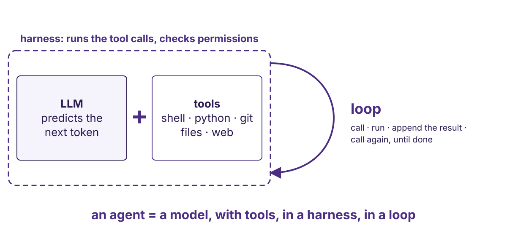{.r-stretch}

::: {.notes}
Four words, and the whole lecture is detail on them. The LLM predicts the next token; it never executes anything. Tools are its hands: the shell, so scripts, Python, git, whatever software the environment has; files; the web. The harness is the program around the model that reads a tool call, checks whether it is allowed, runs it, and hands the result back. The loop is the harness doing that until the model stops asking. Each word gets its own treatment later; this slide stays up until the room can say the sentence at the bottom back to you.
:::

## How we got here {background-color="#f5f3fb"}

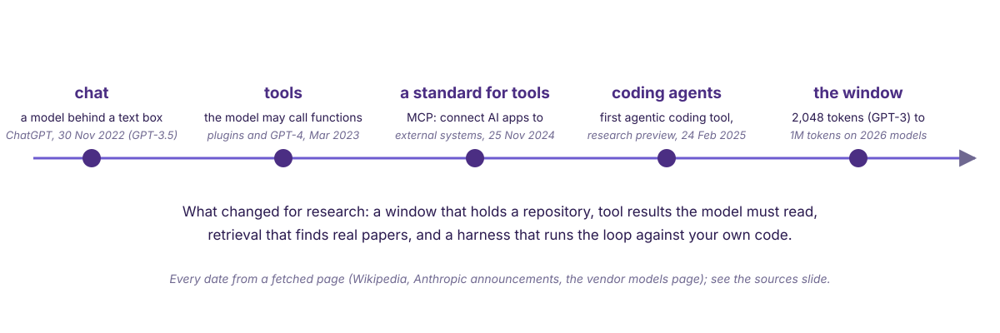{.r-stretch}

::: {.notes}
Everyone has used the first dot: a chat box, 30 November 2022, GPT-3.5, text in and text out, no hands. March 2023: plugins, the model may ask for a function to be called; that is the conceptual step, the rest is training and engineering. November 2024: a standard for plugging tools in. February 2025: this vendor's first coding agent, a research preview that reads code, edits files, runs tests, commits; other vendors had coding agents earlier, and dating them is a TODO. And the window: 2,048 tokens on GPT-3, one million on the largest current models. Then the point of the slide: the window was a big step, but what made this usable is the infrastructure around the model. Fewer hallucinations, because retrieval and tool results ground what it says. And the files: the instructions that say what you want, and the tests that say what done means. Say that it moves fast and that geoscience is lagging; the next slide gives the example. Every date is from a fetched page, on the sources slide; the last two lines on the slide are the lecturer's reading, not a source's.
:::

## Why it is usable now

- **Fewer hallucinations**: retrieval grounds claims in real papers; a tool result, such as a failing test, is a fact in the window
- **The files around the model**: standing instructions say what you want; tests say what done means. Infrastructure, not the model
- **The window holds a repository**: the unit of work is a pull request, not a pasted snippet

::: {.takeaway}
It moves fast: new model types built for decisions, text in and a probability out. Geoscience is lagging.
:::

::: {.todo}
The lecturer's example of a decision-oriented model type (given as "JEV"): name it and cite a fetched page before this line is said.
:::

::: {.notes}
The first and third are from the June post; the second is the lecture's own claim and the reason the "writing your own" segment exists: the instruction file and the test are what turn a model into something you can hand a task to. On speed: name the example once it is sourced; the point is that model types are changing under the harness, and that this field is behind. Hold the sceptic's "why an agent rather than a script" until the payoff segment: the answer is the spec.
:::

## Model, prompt, agent {background-color="#f5f3fb"}

| | |
|---|---|
| **Open-weight model** | weights on your hardware; you pay in compute |
| **Private model** | API only; pay per token; can change under you |
| **Prompt** | text placed in the window. Nothing else happens. |
| **Agent** | the same model, in a loop, with tools |

::: {.notes}
Three definitions and one distinction. HazEvalHub's prototype ran a 7B Qwen and an 8B Llama locally next to cloud models. A prompt reads no file and runs no code; a chat interface hides this by re-sending the transcript. The agent is the model plus something that runs its commands.
:::

## Chat, script, agent

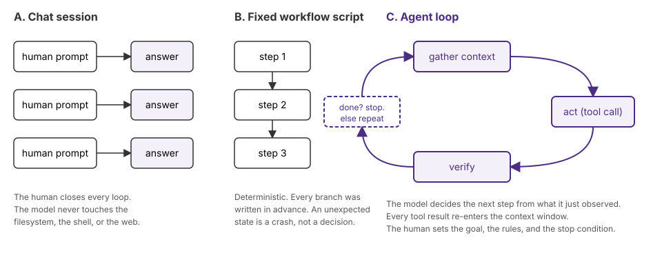{.r-stretch}

::: {.takeaway}
Chat: you close every loop. Script: every branch pre-written. Agent: the model picks the next step; you enter at the start, and where else you enter is the hardest design question, and it keeps moving.
:::

::: {.notes}
Walk left to right. A: quality bounded by your patience for closing loops. B: deterministic; an unexpected input is a crash and a person reads the log. C: gather, act, verify, repeat; an unexpected state becomes a decision, which can be wrong or endless. Now the human. You are always in the loop at the start: the goal, the rules, the stop condition. Where else you sit is the design question: on every action, as the permission prompt; on every diff, as the app shows them; only at the end, as a pull request review; or nowhere, as a headless run. Each of those is a real setting we use, and the trend is that the human enters less and less often. The four verbs are our labels for what the tool calls turn out to be; the model has no stages, only one token stream. Next slide shows the whole thing as code.
:::

## The whole thing, mechanically

```python
messages = [system_prompt, context_file, tool_schemas, task]
while True:
    out = model(messages)                      # one API call: tokens in, tokens out
    if out.stop_reason != "tool_use":
        break                                  # plain text: the model says it is done
    if not permitted(out.tool, out.args):      # the harness pauses here, not the model
        result = "denied by user"
    else:
        result = run(out.tool, out.args)       # shell, file, web, GitHub ...
    messages += [out, tool_result(result)]     # the result re-enters the window
```

::: {.dim}
Line 1: the harness's own standing text · the standing instructions in your repository · the functions the model may call, each with a name, description and argument schema · what you typed. One turn can carry several tool calls; the sketch shows one. A tool call is structured tokens the harness parses: `{"name": "bash", "input": {"command": "pixi run spellcheck"}}`. The harness is this loop plus the permission check. The loop is generic and the same under every vendor's product.
:::

::: {.notes}
This is the debunk. The model is called once per turn with the whole message list and returns tokens. If they end in a structured tool-call block, the harness parses it, checks permissions, runs the function, appends the result, and calls the model again. No memory, no execution inside the model, no stages. Why a tool at all: next-token prediction cannot execute, count, or do arithmetic reliably; a shell with python in it is the workaround. A subagent is this loop started again with a fresh message list, launched by a tool call, whose final text comes back as a tool result. A permission prompt is the harness pausing between parse and run. The loop is only as good as its verify step, and it has no natural end: done, budget, or killed.
:::

## Four ways to use one today {background-color="#f5f3fb"}

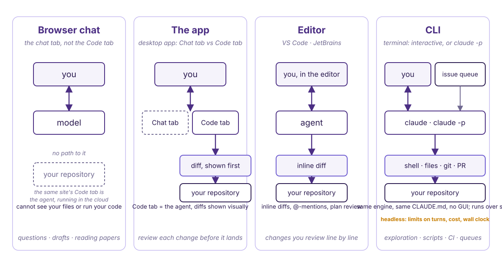{.r-stretch}

::: {.notes}
Surfaces from the vendor's documentation: terminal, VS Code and JetBrains, desktop app, web, one engine, one CLAUDE.md across all of them. The useful cut for this room: what can it touch, and who is watching. Browser chat cannot see your files or run your code; most beliefs about "AI coding" come from pasting snippets there. The app's Chat tab and Code tab are the same model without and with the loop: switching tabs is switching from panel A to panel C. The editor shows inline diffs; the CLI is the full surface, interactive or headless.
:::

## What each one can touch {.smaller}

| | Touches your repo | Who watches | Needs | Runs on a cluster over ssh |
|---|---|---|---|---|
| **Browser, Chat tab** | no | you, every turn | an account | n/a |
| **Browser, Code tab** | yes, in the cloud | you, per session | subscription | n/a |
| **App, Code tab** | yes | you, per diff; or nobody, if scheduled | subscription; download | no |
| **Editor** | yes | you, per line | subscription or key; extension | remote-editor setups: TODO |
| **CLI** `claude` / `-p` | yes | you, per gated action / nobody | subscription or key; one-line install | yes, if the node reaches the API |

::: {.dim}
"Gated": a tool call the permission settings say must be approved first. Needs and installs from the vendor's overview page. TODO from fetched pages: monthly prices, which actions are gated by default, whether an unpublished repo is used for training. Start with the app's Code tab; the tutorials use the CLI because its transcript can be captured. Other vendors ship the same shapes (the lecturer names OpenAI's Codex); the names differ, the loop does not.
:::

::: {.notes}
Read the table down "who watches": that is the real difference between rows. Two rows have "nobody" in them: headless CLI and scheduled app tasks; both need limits on turns, cost and wall clock. The cluster column is the HPC question: only the CLI is a plain terminal program.
:::

## Headless on cascadia, the group's machine

```
for issue in open_issues:
    claude -p "smallest change that resolves #<issue>; open a PR"
```

::: {.todo}
Repository · issue numbers · exact minimal-change wording and where it lived · scheduler · permission mode · the run that did not stop: what it repeated, how long, cost, how detected, who killed it, what it left behind.
:::

::: {.takeaway}
A run nobody watches needs a turn limit, a cost limit, and a wall-clock limit.
:::

::: {.notes}
The shape is real; the specifics are not written down. Tell it from memory and say that is what it is. The lesson does not depend on the numbers.
:::

## The pieces that let a model act {background-color="#f5f3fb"}

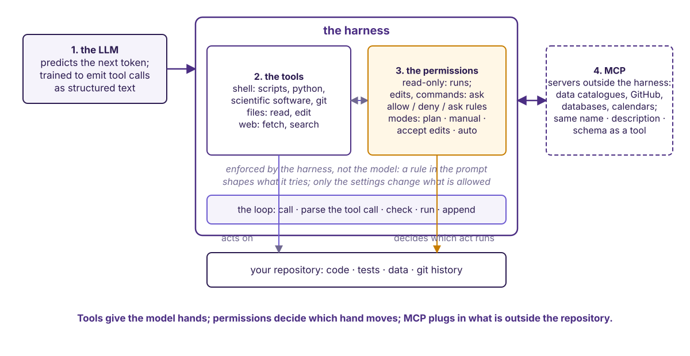{.r-stretch}

::: {.notes}
Four things. One, the LLM: predicts tokens, trained to emit a tool call as structured text, never executes. Two, the tools: the shell, so scripts, Python, whatever scientific software the environment has, git; file read and edit; web fetch and search. "Can it run ObsPy" has the same answer as "can you". Three, the permissions, the harness's gate between the parsed call and its execution; the defaults are the vendor's: reads and searches run, shell commands ask except a read-only set, edits ask, web asks. Rules per tool and pattern, modes that shift the whole gate. Read the vendor's sentence aloud: rules are enforced by the harness, not the model; a prompt shapes what it tries, only the settings change what is allowed. Four, MCP: tools outside the harness, advertised with the same name, description and schema, so a data catalogue looks like one more function. That is what lets model plus tools act beyond the repository, and what adds a party whose output the model will act on.
:::

## Context file: ours

```
CLAUDE.md  →  5 lines, points at AGENTS.md
AGENTS.md  →  one screen: layout · build commands ·
              seven conventions · persona reviews
```

::: {.takeaway}
What a good collaborator needs on day one and cannot find by reading the code. Nothing else.
:::

::: {.notes}
Show what it omits: no MyST tutorial, no restated CONTRIBUTING. The vendor docs say this harness reads CLAUDE.md and can read an AGENTS.md written for other agents; other products keep their file elsewhere. The March post: knowledge anchor, standing instructions, situated prompt; the first two set output quality; the instructions are a living document.
:::

## Where the files live

```{.text .bigcode}
your-repo/
├── AGENTS.md, CLAUDE.md       instructions, read every session
├── .claude/
│   ├── settings.json          permissions: allow / deny / ask
│   ├── settings.local.json    your approvals, git-ignored
│   ├── skills/<name>/SKILL.md procedures, loaded on demand
│   └── agents/<name>.md       subagents: role, tools, model, mode
├── .mcp.json                  MCP servers, shared via git
├── review-logs/<date>/        what the agents wrote, dated
└── src/  tests/  docs/  SPEC.md
```

::: {.dim}
Paths from the vendor's permissions, MCP and subagents pages. This repository ignores everything under `.claude/` except `skills/` and `agents/`, so local approvals never reach git.
:::

::: {.notes}
Thirty seconds; leave it up. The answer to "what did you commit": the instructions, the shared rules, the skills, the agent definitions, the MCP list. Never the local approvals, never a key.
:::

## The context window

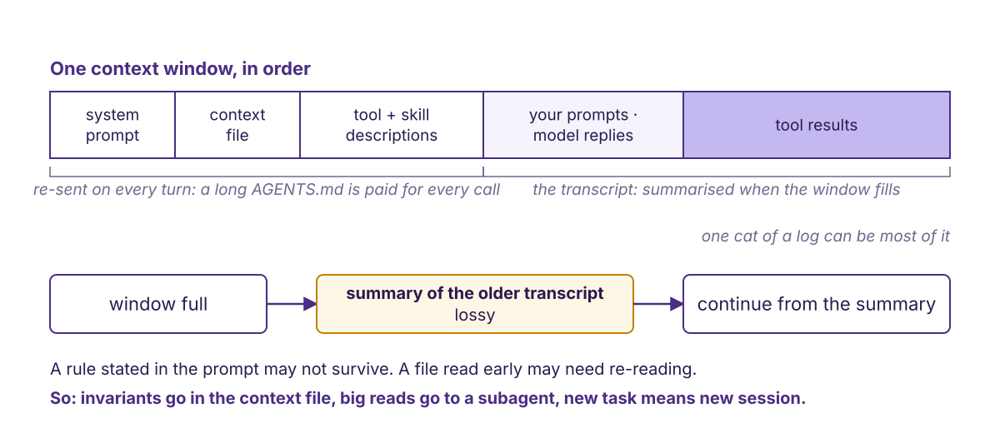{.r-stretch}

::: {.dim}
Recall drops for material in the middle of a long context (Liu et al., 2024, TACL; on the sources slide). Compaction is itself a model call: the harness asks the model to summarise, then swaps the messages.
:::

::: {.notes}
Tool results are the part people forget. Compaction is a lossy summary; rules in the prompt may not survive it. Consequences: invariants in the context file, big reads in a subagent, new task in a new session. When a good agent drifts, suspect the window first.
:::

## Skills, and MCP again {.smaller}

| | What it is | Ours |
|---|---|---|
| **Skill** | `SKILL.md`: description in the window from startup; the model picks it, the harness loads the body | `plain-voice`; one more built live later |
| **MCP** | open standard for connecting AI applications to external systems; "a USB-C port for AI applications" | `.mcp.json`; tutorial 3 |
| **Subagent** | an agent definition with its own window; writing your own | ten reviewer files → `review-logs/` |

::: {.takeaway}
A skill costs its description on every call and its body only when loaded. Every MCP server you connect is a party whose output the model will act on.
:::

::: {.dim}
Vendor conventions: `CLAUDE.md`, skills, `claude -p`. General: the loop, `AGENTS.md` (this vendor's docs say it reads that too), MCP as a published standard. Prompt injection: tool results and instructions are one token stream with no provenance bit; a sentence inside a fetched page reads like a sentence from you.
:::

::: {.notes}
The description is the part to keep short: re-sent on every call whether or not the skill fires; the body can be long. plain-voice: about 60 words of description, 2300 of body. Subagents buy a fresh window and attention per task, not fewer tokens. MCP definition and analogy are the protocol site's own words; the spec lives at modelcontextprotocol.io. Capability by configuration, risk by the same route.
:::

## Where it pays off for you {background-color="#f5f3fb"}

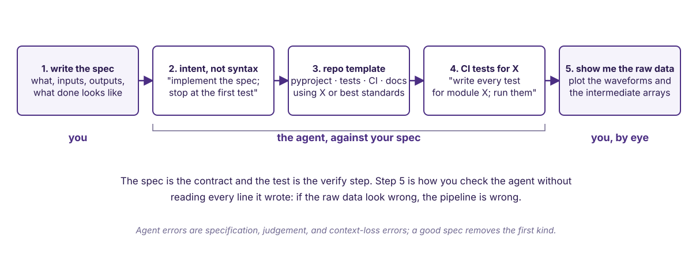{.r-stretch}

::: {.notes}
The answer to "why an agent rather than a script". A script when you know every step; an agent when you can state what done looks like but not how to get there, and getting there is mostly typing you have done before. Five uses in project order: you write the spec; the agent works to it; you look at the raw data.
:::

## 1. Write the spec first

```
# SPEC: <name>
1. Purpose: one sentence.
2. Inputs: files, formats, units, coordinate frames.
3. Outputs: files, formats, units; what a plot of them should look like.
4. Conventions: layout, style, test runner (pytest), CI (GitHub Actions),
   licence (MIT), the checks that must stay green.
5. Done when: pytest tests/test_<name>.py passes; docs/figures/<name>.png shows <what>.
6. Out of scope: what not to touch.
```

::: {.takeaway}
Draft it with the agent, edit it yourself. Section 4 is what stops the agent choosing the runner, the CI and the licence for you.
:::

::: {.notes}
Agent errors are specification and judgement errors. A good spec removes the first kind and makes the second visible. Then: intent, not syntax: "implement section 3; stop when the first test passes" rather than "write a function that opens the file".
:::

## 2 to 4. Intent, template, tests

```
2. "Implement section 3 of SPEC.md; stop when pytest tests/test_io.py passes."

3. "Set up a Python repository for X using pixi and section 4 of SPEC.md:
    pyproject, one passing test, CI that runs it, README, licence, .gitignore."

4. "Write the tests for module X from section 5 of SPEC.md and run them with
    pytest. If a test fails, tell me whether the test or X is wrong before
    changing either."
```

::: {.takeaway}
State the goal and the stop condition; the agent picks the steps. On a new module, 4 comes before 2. Check the template against the list in section 4.
:::

::: {.notes}
Three prompt shapes, numbered as in the figure. If the test in prompt 2's stop condition does not exist, prompt 4 comes first. The last sentence of prompt 4 replaces "do not change X to make a test pass", which the agent resolves by declaring the test right whenever fixing X is easier; asking for the judgement first puts it in the transcript. The template is, in the lecturer's experience, an afternoon of boilerplate done in minutes; the CSSI plan's gaia-template-agent is this use made reusable.
:::

## 5. Show me the raw data

```
5. "After each function in pipeline.py that returns an array, save a figure
    of its output to docs/figures/<function>.png; for each table, its first
    and last five rows to docs/figures/<function>.txt; list them in README."
```

::: {.takeaway}
Tests written by the same agent inherit its reading of the spec; the raw data do not. If they look wrong, the pipeline is wrong, whatever the tests say.
:::

::: {.notes}
The one use on the list that is specific to science, and the one the room should leave with. It is also the cheapest guardrail we have.
:::

## Live: a real act and a real verify

**Before the talk:** `book/teaching/demo.md` with one misspelling codespell knows (receive with i and e swapped), confirmed with `pixi run codespell book/teaching/demo.md`. Not committed.

**Ask:** `codespell book/teaching/demo.md` reports an error; fix it and show me that command passes.

**Watch:** run the check → read the page → edit one word → rerun → exit 0

::: {.takeaway}
The pass condition is the repository's own check, not the model's opinion. More than one word edited is the minimal-change rule in `AGENTS.md` broken in front of you.
:::

::: {.notes}
Two minutes, rehearsed. Scoped to one file because the repo-wide check would also catch any other uncommitted typo and confound the one-word lesson. Narrate each call as it appears. If the agent reruns the check on its own, point at it: that is the verify step nobody told it to do. Delete the scratch page afterwards; a committed misspelling fails CI.
:::

## Writing your own {background-color="#f5f3fb"}

| | You write | Choose it when | Start from |
|---|---|---|---|
| **A line in `AGENTS.md`** | one sentence | the rule is short and always applies | `AGENTS.md` |
| **A skill** | a `SKILL.md` | this session should follow a longer procedure, in its own window | `.claude/skills/plain-voice` |
| **An agent definition** (a subagent) | a Markdown file: role, tools, model, permission mode, instructions | the task needs a fresh window, fewer tools, or parallel copies | `.claude/agents/`, next two slides |
| **A loop in Python** | tools as functions | you need a tool the harness lacks, a run you control end to end, or a model it does not drive | fifteen lines, next slide |

::: {.notes}
Three ways, in increasing order of how much you own. The first two are files in this repository; copy one and change it. The third is for a model or a harness the vendor's product does not run.
:::

## Live: the skill

```
---
name: nsf-acknowledgement
description: Insert the agreed GAIA acknowledgement wording for the NSF
  awards, verbatim, when a page, talk, poster or paper needs a funding
  statement.
---
1. Read the block-quoted wording from book/governance/how-we-work.md,
   section "Acknowledgement". Never embed it here.
2. Insert it verbatim, all three award numbers, under an "Acknowledgements"
   heading at the end of the page unless told where.
3. If the seed grant or the Paros Center contributed, append the clause the
   page gives below the block quote, in place of the final full stop.
```

::: {.dim}
File: `.claude/skills/nsf-acknowledgement/SKILL.md`; line 1 is the front-matter fence.
:::

::: {.dim}
An agent definition has the same shape plus `tools:`, `model:`, `permissionMode:` and `maxTurns:` lines; an illustrative one is on the lecture page.
:::

::: {.notes}
Type it live. Fresh session, ask for a funding acknowledgement on mt-rainier.md, watch whether it triggers; if not, the description did not match: fix it in front of the room. The model picks the skill from its description; the harness loads the body; the body reads the page at use time so there is one source of truth. Loading a skill is itself a tool call, but it adds no capability: it can only use the tools the agent already has. Longer descriptions fire more reliably and cost more per call.
:::

## A subagent, and its rubric and references

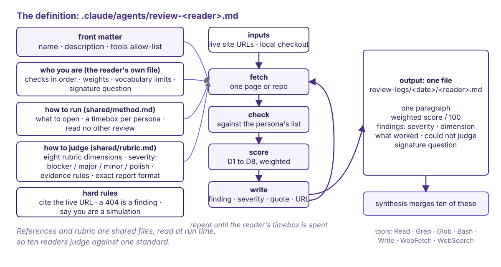{.r-stretch}

::: {.notes}
What a subagent is: the vendor's page says a specialised assistant for one kind of task, in its own context window with its own system prompt, tools and permissions; mechanically, the loop from the code slide started again with a fresh message list, launched by a tool call, whose final text returns as a tool result. The definition is a Markdown file under .claude/agents with front matter: name, description, tools, model, permissionMode, maxTurns. Its rubric and references: the instructions are two lines because the method (what to open, a timebox) and the rubric (dimensions, severity, evidence rules, report format) are shared files it reads at run time; that is what makes ten readers comparable. The reader role in the figure is illustrative.
:::

## Adversarial reviews: ten readers, one rubric

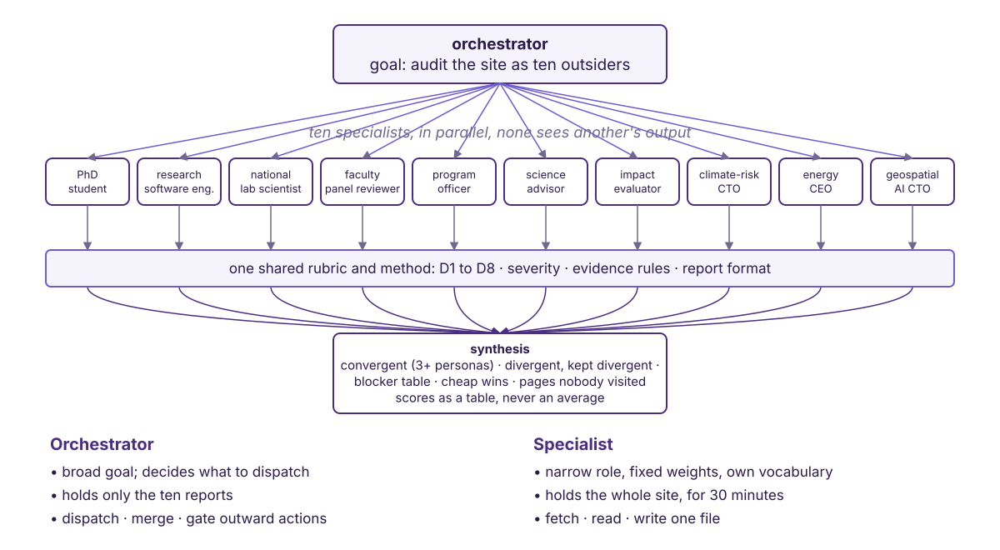{.r-stretch}

::: {.notes}
Once a reviewer is a file, ten reviewers are ten files: an orchestrator runs them in parallel on the same page, none seeing another's output, then synthesises: keep what three or more raised, keep disagreements as disagreements, list blockers, scores as a table never an average. Isolation stops copying; it does not remove the shared weights, so convergence is a lead, not a statistic. Ten windows' worth of tokens, not fewer. Injection enters where the reports re-enter the parent as tool results; keep only the fields the report format defines. Roles are illustrative; choose them for the page. If running long, talk over this slide rather than show it.
:::

## The loop in fifteen real lines

```python
import subprocess, anthropic
from anthropic import beta_tool

client = anthropic.Anthropic()

@beta_tool
def spellcheck(path: str) -> str:
    """Run the repository spellcheck on one file and return its output."""
    r = subprocess.run(["codespell", path], capture_output=True, text=True)
    return r.stdout or "clean"

runner = client.beta.messages.tool_runner(
    model="claude-opus-5", max_tokens=16000, tools=[spellcheck],
    messages=[{"role": "user", "content": "Run the spellcheck on book/teaching/demo.md; report."}],
)
for message in runner:   # one iteration per model turn; stops when no tool is called
    print(message)
```

::: {.dim}
Shape from the vendor SDK reference; `client.beta` says the runner is a beta helper. To run: `pip install anthropic` (not in this repo's pixi env), Python 3.10+, a key or the vendor login, `codespell` on the path (`pixi run python`). The tool only checks, so the task is to report; an edit tool is what you add next. For a local server that speaks the same API, the client takes a `base_url` (TODO: verify with eScience's server).
:::

::: {.todo}
Verify against the installed SDK version before showing; add the Agent SDK link from a fetched page.
:::

::: {.notes}
A tool is a decorated function with a docstring; the runner drives the loop and stops when the model makes no tool call. This is the whole of "writing an agent" for anything the harness does not already do. Other vendors have equivalents.
:::

## Where agents sit in GAIA, and how we score them {background-color="#f5f3fb"}

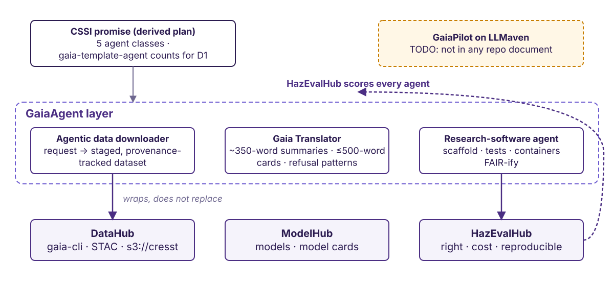{.r-stretch}

::: {.notes}
Three hubs, three named agents in the GaiaAgent layer, HazEvalHub scoring all of them; the FrugalMind board on the diagrams is HazEvalHub's live prototype, one thing under two names. The downloader wraps gaia-cli, STAC and s3://cresst; it does not replace them, and its book page is a draft. The translator is the most designed: 350-word summaries, 500-word cards, refusal patterns, an expert-eval plan. GaiaPilot on LLMaven is amber because no repo document mentions it; if still unresolved, drop it.
:::

## What the proposal promised {.smaller}

| Agent class | Job |
|---|---|
| RSE agent | scaffold, test, containerise, FAIR-ify |
| Data-interrogation | query DataHub, build AI-ready cubes |
| Modelling / surrogate | train, evaluate, emit model cards |
| Coordination | summaries, digests, metrics narratives |
| Translator | natural language → workflow across hubs |

::: {.dim}
Derived plan, project_coordination/03. First build, by the documents alone: `gaia-template-agent`, the unit the delivery metric D1 counts (a delivery metric, not a rubric dimension), and the repository-template use from the payoff segment made reusable.
:::

::: {.todo}
Check against the funded proposal text; note any promised agent the derived plan dropped. Lead PI's build order.
:::

::: {.notes}
Proposal is git-ignored; the public derivative is the coordination plan. Templates count for D1 only when CI is green.
:::

## How we score an agent

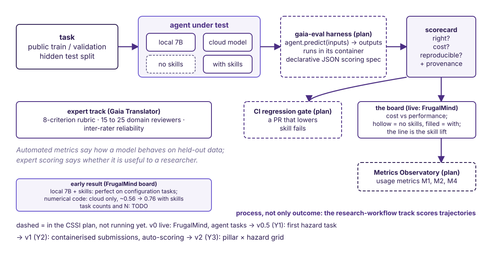{.r-stretch}

::: {.takeaway}
Three questions per submission, a hidden test split, cost on the axis. The board is live for agent tasks; dashed boxes are the CSSI plan, years one to three.
:::

::: {.notes}
A CSSI deliverable, not an aside. Task with a hidden test split; four conditions: local or cloud, with or without skills; the harness runs it in its container against a declarative JSON scoring spec and emits a scorecard: right, cost, reproducible, plus provenance. Consumers: the board, where the line between hollow and filled is the skill lift; a CI regression gate; the Metrics Observatory. The expert track answers whether the answer is useful, not how the model behaves. Tutorial 4 is a miniature of this diagram.
:::

## Guardrails, trajectory, cost, reproducibility {background-color="#f5f3fb"}

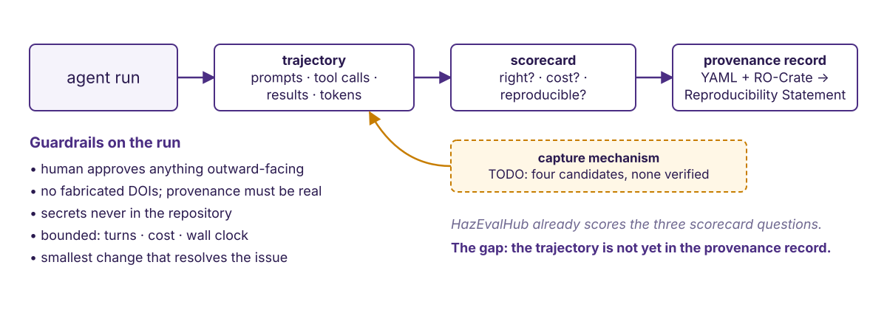{.r-stretch}

::: {.takeaway}
If an agent cannot reproduce your work, neither can your collaborators: a Reproducibility Statement in every paper, and the trajectory inside the provenance record. Tutorial 4 builds toward it.
:::

::: {.notes}
Guardrails: three from the coordination plan, two from practice. The trajectory is the record we owe every reader; HazEvalHub already scores three questions per submission and names trajectory scoring. The amber box is the open question: four capture candidates, none verified. The decision is the group's: default mechanism, storage, who may read.
:::

## Why two runs differ

- **Sampling**: the next token is drawn, not argmaxed; the API used here exposes no seed and, on its newest models, no sampling parameters at all
- **Batched inference**: generally not bit-reproducible on shared accelerators (TODO: cite before saying aloud)
- **Model updates**: a name can point at new weights; the vendor's current IDs are pinned snapshots, so record the ID per run
- **Tool results**: the web, the data, and the repo moved between runs

::: {.takeaway}
Reproducibility of an agent run is statistical. Report N, pin versions, keep every tool result.
:::

::: {.notes}
Tutorial 4 scores reproducibility as the fraction of identical outputs across N runs. These four are what makes that fraction less than one. The first two are properties of the model service; the third is recorded if you log the model ID with each run; only the trajectory records the fourth.
:::

## Cost

::: {.big-number}
~$200 / month [one person, one project, the coding agent; no model or run count given. Denolle (June 2026)]{.unit}
:::

::: {.dim}
Scale: the vendor's current models cost 1 to 10 dollars per million input tokens and 5 to 50 per million output (models page, 21 Sep 2026).
:::

::: {.takeaway}
Cost is a first-class axis: recorded per run, reported next to accuracy. On the FrugalMind board, local 7B models with skills scored perfectly on configuration tasks and failed numerical code, where cloud models went from about 0.56 to 0.76 with skills. Task counts and N: TODO.
:::

::: {.notes}
One fact from practice, one from the eval board. The skill-lift result is why open-weight models stay in the comparison. Tutorial costs are TODO in the compute-requirements document.
:::

## Tutorials

:::: {.columns}
::: {.column width="45%"}
1. **Anatomy of an agent**: one bounded run, captured and labelled
2. **Your first skill**: the acknowledgement skill, tested, versioned
3. **Subagents and orchestration**: fan out, merge, file behind a gate
4. **Evaluating runs**: right · cost · reproducible
:::
::: {.column width="55%"}
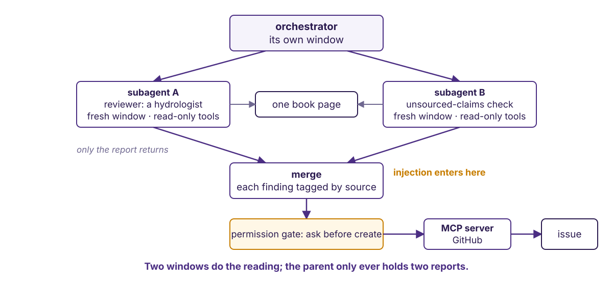
:::
::::

::: {.notes}
Stubs under Teaching in the book; code cells filled with eScience; compute needs in the companion document. The diagram is tutorial 3's exercise. Ask who joins the dry run.
:::

## Sources {visibility="uncounted"}



::: {.notes}
Two blog posts from our own practice, the eScience half-day this mirrors, the vendor's own documentation for the surfaces, and one paper. Nothing on this deck is cited from memory; the amber blocks are what is still unverified.
:::

